# Gestión de partes #

Está aplicación está diseñada para su uso en una empresa de transportes. Permite la gestión de centros de trabajo, vehículos, trabajadores y partes.

- [¿Cómo funciona?](#cómo-funciona)

- [Requisitos](#requisitos)

- [Pasos para la instalación](#pasos-para-la-instalación)

- [Configuración](#configuración)

- [Uso de la aplicación](#uso-de-la-aplicación)

- [Uso como transportista](#transportista)
	
- [Uso como administrativo](#administrativo)

    - [Nuevo centro](#centros--nuevo-centro)
	
    - [Listado centros](#centros--listado-centros)

    - [Nuevo trabajador](#trabajadores--nuevo-trabajador)

    - [Listar trabajadores](#trabajadores--listar-trabajadores)

    - [Nuevo usuario](#trabajadores--nuevo-usuario)
	
	- [Nuevo vehículo](#vehículos--nuevo-vehículo)
	
	- [Listar vehículos](#vehículos--listar-vehículos)
	
	- [Gestión de partes](#partes--gestión-de-partes)


## ¿Cómo funciona? ##

Existen dos tipos de trabajadores:

* Transportistas 
	
	Crean los partes de trabajo según los repartos que hayan realizado en su jornada laboral. Además pueden adjuntar los gastos de gasoil o dietas, entre otros, y dejar constancia de las incidencias recogidas.
	
* Administrativos
	
	Gestionan altas y bajas de centros, trabajadores y vehículos. También validan que los transportistas hayan rellenado los partes correctamente y no hayan excedido su jornada laboral.
		
## Requisitos: ##
	
	Una base de datos Oracle DataBase 12c o superior.

## Pasos para la instalación: ##

##### ¡OJO! El orden de ejecución es importante. #####
	
1. Ejecutar el [script](MODELO_FÍSICO/SCRIPT_FISICO.ddl) sobre la base de datos.

> Este script crea las tabla necesarias y la configuración de usuario, contraseña y servidor que va a utilizar la aplicación.
> Si necesitas cambiar estos datos, puedes consultar [aquí](#configuración) como hacerlo.
	
2. Ejecutar el script de [procedimientos](PL_SQL/Pl-sql.sql) sobre la base de datos.

3. Iniciar el ejecutable [Proyecto](Proyecto/dist/Proyecto.jar).

> Si quieres cambiar la ubicación de este archivo debes mover también la carpeta [lib](Proyecto/dist) a la misma carpeta que el ejecutable.
> Es recomendable que crees un acceso directo, por ejemplo a tu escritorio.

## Configuración ##

El script de creación configura automáticamente la conexión de la aplicación con la base de datos.

En caso de que necesites otra configuración diferente, sigue estos pasos:

* Cambios en el [script de creación](MODELO_FÍSICO/SCRIPT_FISICO.ddl)

```sql
-- USER SQL
CREATE USER Aplicacion IDENTIFIED BY a12345Abcde ;
--Cambiar Aplicacion por el nuevo usuario y a12345Abcde por la contraseña

-- ROLES
GRANT "DBA" TO Aplicacion ;	
GRANT "CONNECT" TO Aplicacion ;
GRANT "RESOURCE" TO Aplicacion ;
--Cambiar Aplicacion en las tres líneas por el nuevo usuario.
```

* Cambios en java en la clase [ControladorBaseDatos](Proyecto/src/Modelo/ControladorBaseDatos.java)

```java
public static void conectar(){ 
        try{ 
            Class.forName("oracle.jdbc.OracleDriver"); 
            String login = "Aplicacion"; //Cambiar por el usuario creado en la base de datos.
            String pass = "a12345Abcde"; //Cambar por la contraseña usada en la base de datos.
            String url = "jdbc:oracle:thin:@10.10.10.9:1521:db12102"; //Cambiar @10.10.10.9 por la ip del servidor y db12102 por el nombre de la base de datos.            
            conexion = DriverManager.getConnection(url,login,pass); 
            conexion.setAutoCommit(true); 
        }catch(ClassNotFoundException | SQLException ex){ 
            JOptionPane.showMessageDialog(null,"Ha ocurrido un problema \n"+ex.getMessage()); 
        }  
```

## Uso de la aplicación ##

La aplicación se inicia en la ventana login. 

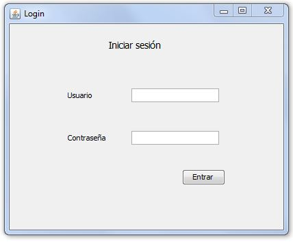

Si es la primera vez que la utilizas, usa las siguientes credenciales para iniciar sesión:

    Usuario: admin
	Contraseña: aaaaa
	
> Una vez dados de alta los usuarios, cada uno utilizará sus propias credenciales. También es recomendable borrar este usuario y sus datos relacionados. Puedes ver cómo hacerlo [aquí]().

Dependiendo de si el usuario es _Transportista_ o _Administrativo_ se iniciará la ventana correspondiente.

### Transportista ###

En el caso de _Transportista_ se inicia la ventana _Parte_.

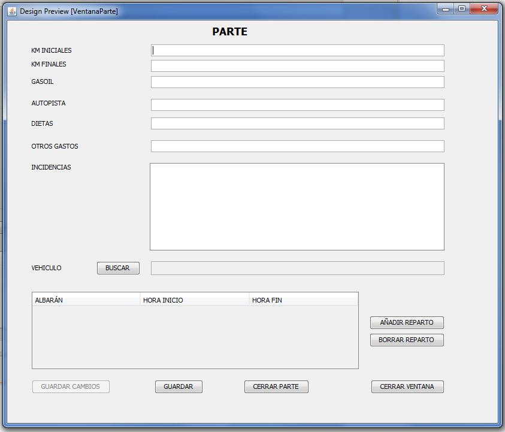

Aquí nos encontramos dos opciones:

* Nuevo parte. El formulario aparece vacío.
* Parte abierto. El formulario aparece completado con los datos que hemos guardado previamente.

Para añadir un vehículo pulsamos en el botón _Buscar_ y aparecerá la ventana _Buscar vehículo_.

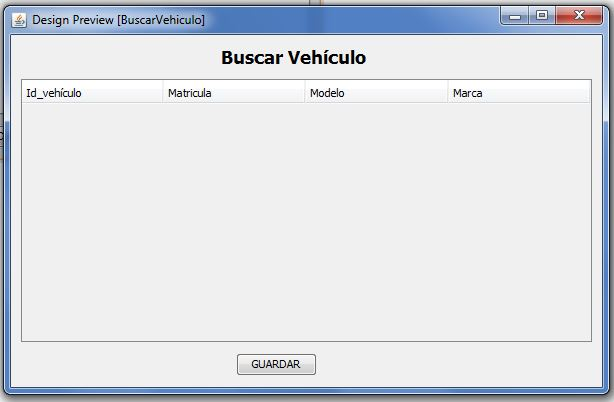

Seleccionamos el vehículo pinchando en la tabla y a continuación en _Guardar_. Se cerrará esta ventana y volveremos a la anterior.

Para añadir repartos pulsamos el botón _Añadir reparto_ y aparecerá la ventana _Reparto_.

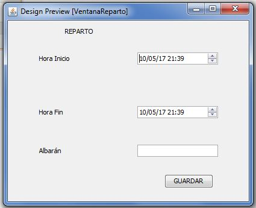

Elegimos la hora de inicio y la hora de fin, escribimos el número de albarán y pulsamos en _Guardar_. 

> En caso de equivocación pinchamos en el reparto correspondiente en la tabla y pulsamos en _Borrar reparto_.

Podemos guardar el parte para continuar más tarde en _Guardar_ o cerrarlo definitivamente en _Cerrar parte_.

### Administrativo ###

En el caso de _Administrativo_ se inicia la ventana _Administrativo Home_.

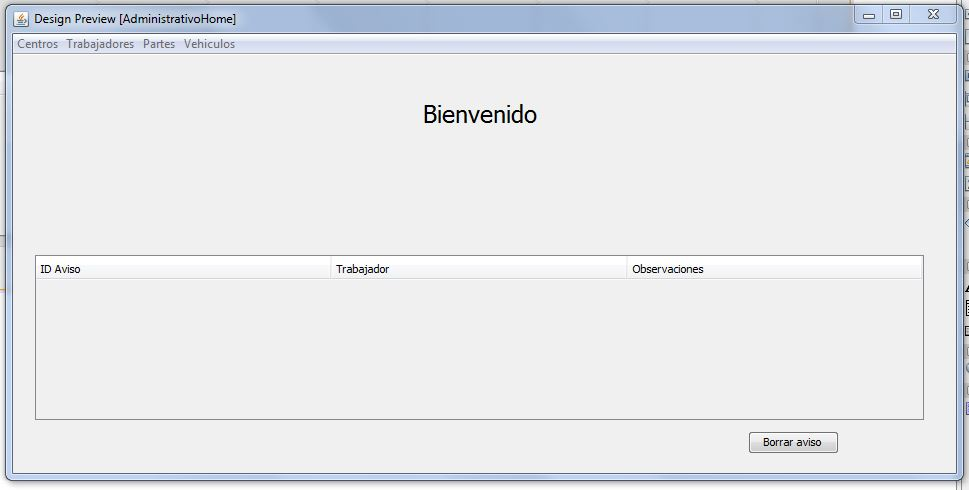

En caso de que exista algún aviso se mostrará en el cuadro. Una vez leído se puede borrar seleccionandolo en la tabla y pulsando en el botón _Borrar Aviso_.

En el menú podemos elegir la acción que queremos realizar.

#### Centros / Nuevo centro ####

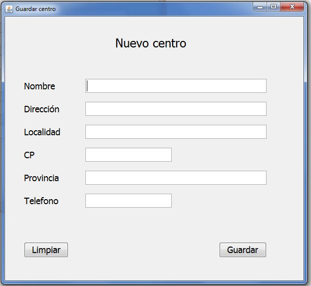

Una vez rellenado el formulario pulsamos en _Guardar_.

#### Centros / Listado centros ####

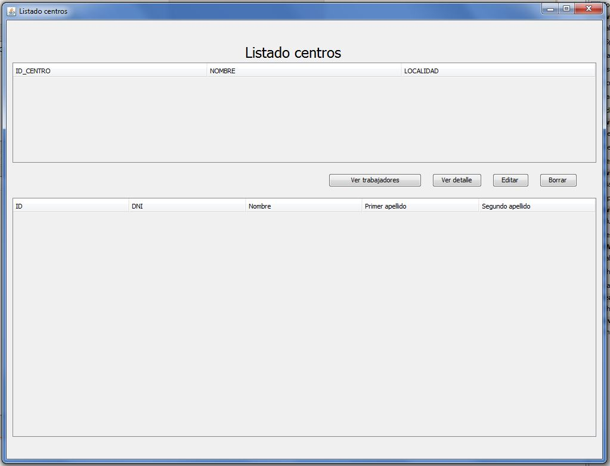

Seleccionamos en la tabla el centro a consultar y pulsamos una de las opciones:

  * Ver trabajadores

En la tabla inferior se muestra un listado con los trabajadores de ese centro.

  * Ver detalle

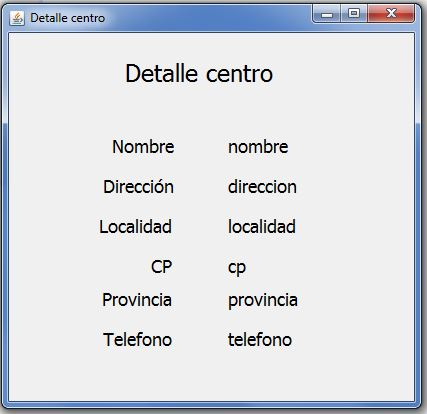

Se muestran los datos referentes a ese centro.

  * Editar

Se abre un nuevo formulario que permite hacer los cambios necesarios y guardarlos.

  * Borrar

Se borra el centro seleccionado.

#### Trabajadores / Nuevo trabajador ####

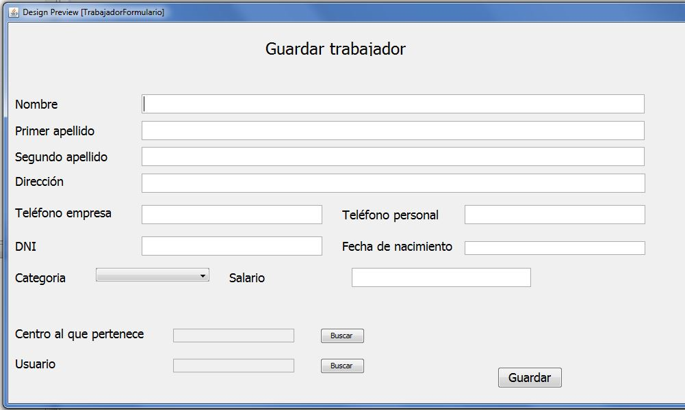

Antes de añadir un trabajador es necesario haber insertado el [centro](#centros--nuevo-centro) al que pertenece y el [usuario](#trabajadores--nuevo-usuario).

Para asignar el centro al que pertenece pulsamos en buscar y se abrirá la ventana _Buscar centro_.

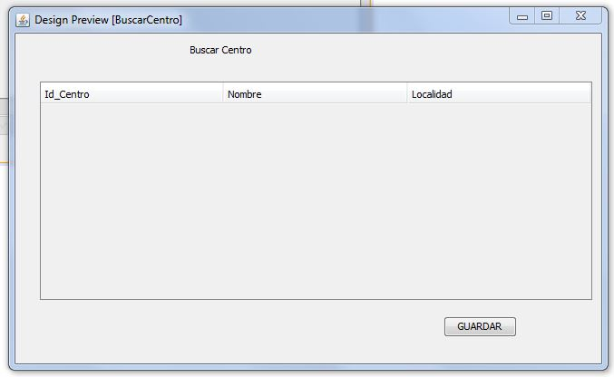

Marcamos en la tabla el centro elegido y pulsamos _Guardar_.

Para asignar un usuario pulsamos en buscar y se abrirá la ventana _Buscar usuario_.

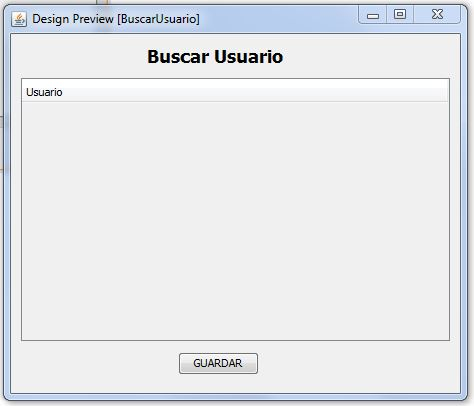

Seleccionamos en la tabla el usuario y pulsamos guardar.

#### Trabajadores / Listar trabajadores ####

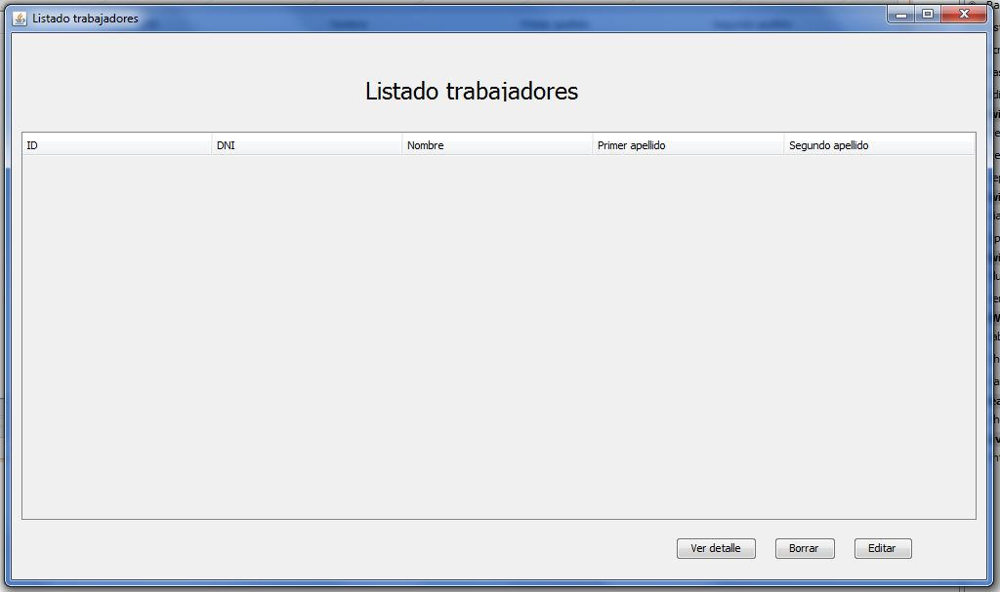

Seleccionamos en la tabla el trabajador a consultar y pulsamos una de las opciones:

  * Ver detalle

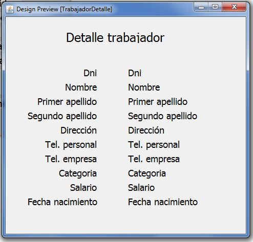

Se muestran los datos referentes a ese trabajador.

  * Editar

Se abre un nuevo formulario que permite hacer los cambios necesarios y guardarlos.

  * Borrar

Se borra el trabajador seleccionado.

#### Trabajadores / Nuevo usuario ####


Rellenamos el formulario y pulsamos guardar.


Para asignar un centro pulsamos en buscar y se abrirá la ventana _Buscar centro_.

Marcamos en la tabla el centro elegido y pulsamos _Guardar_.

Para asignar un usuario pulsamos en buscar y se abrirá la ventana _Buscar usuario_.


Seleccionamos en la tabla el usuario y pulsamos guardar.

#### Vehículos / Nuevo vehículo ####

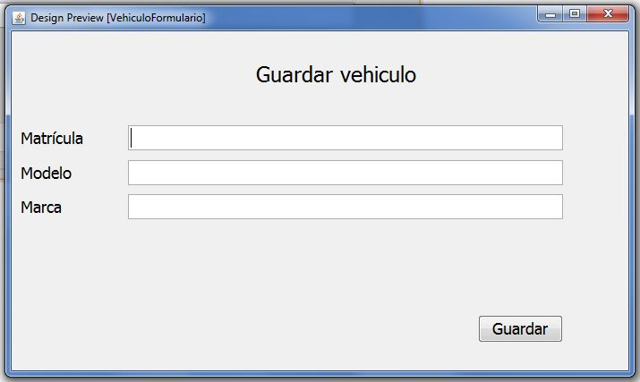

Rellenamos el formulario y pulsamos guardar.

#### Vehículos / Listar vehículos ####

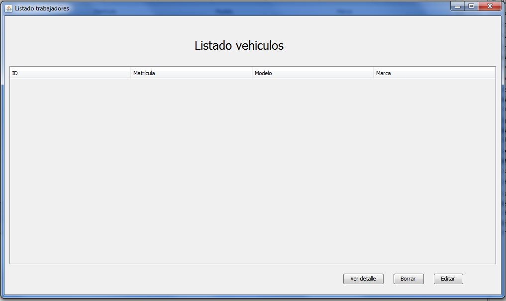

Seleccionamos en la tabla el vehículo a consultar y pulsamos una de las opciones:

  * Ver detalle

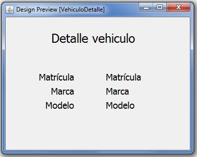

Se muestran los datos referentes a ese vehiculo.

  * Editar

Se abre un nuevo formulario que permite hacer los cambios necesarios y guardarlos.

  * Borrar

Se borra el vehiculo seleccionado.

#### Partes / Gestión de partes ####

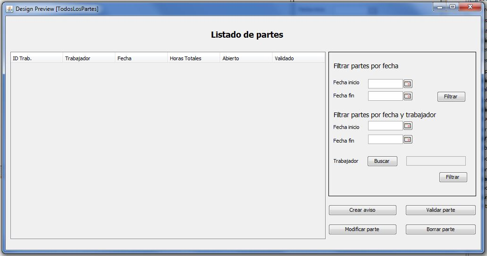

En la tabla aparecen todos los partes y su estado.

En la parte derecha pueden filtrarse por rango de fechas o trabajador y rango de fechas. Para elegir el trabajador pulsamos en _Buscar_ y se abre la ventana _Buscar trabajador_.

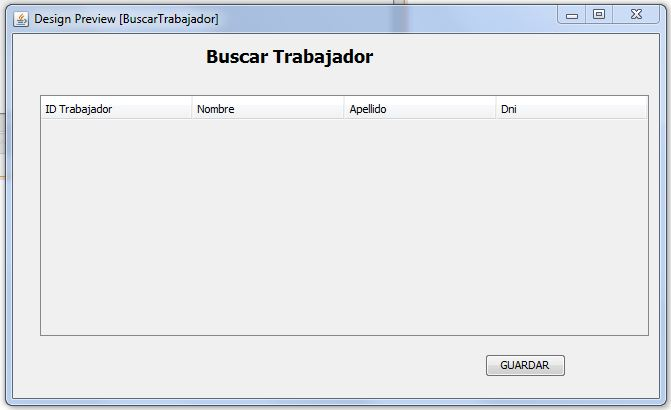

Seleccionamos en la tabla el trabajador y pulsamos guardar.

Para gestionar un parte los seleccionamos en la tabla y elegimos una de las siguientes opciones:

  * Crear aviso
  
Esta opción nos permite almacenar un aviso para el trabajador al que pertenece el parte y que sepa que se ha dejado el parte abierto.

  * Validar parte
 
Cambia el estado a validado. Una vez validado un parte no se puede modificar ni borrar.

  * Modificar parte
  
Muestra el formulario de edición de partes. (Sólo permitido en partes no validados).

  * Borrar parte
  
Borra el parte seleccionado. (Sólo permitido en partes no validados).


